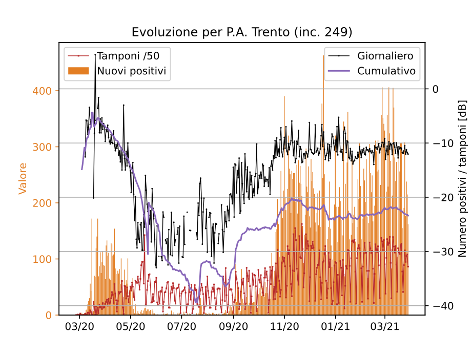
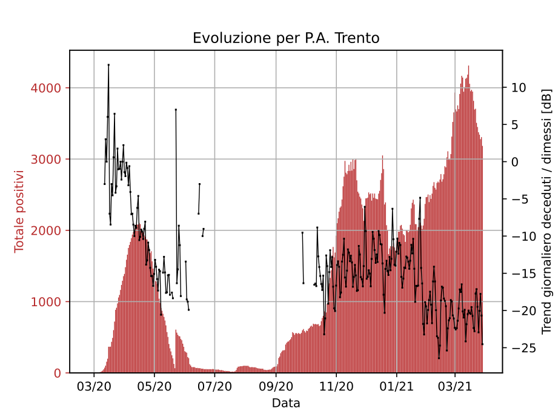
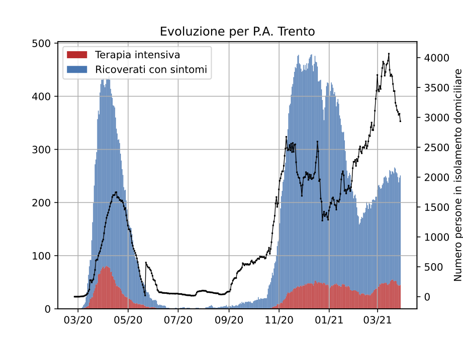
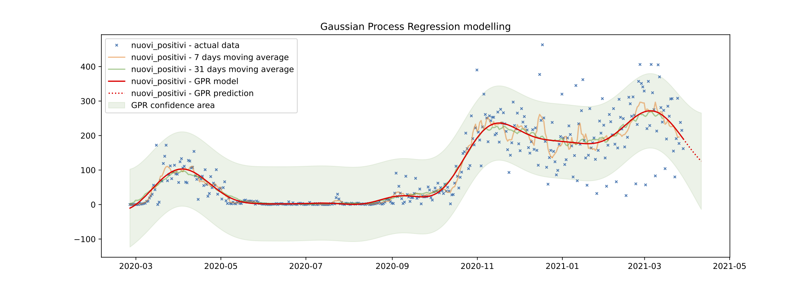

# covid19-regional-tracker
Track the progress of the pandemic in your region (Italy)


## Configure virtual environment

First make sure that all the scripts and the python files have execution permissions. If that is not the case just use the following command:

    chmod +x setup.sh covid19-regional-tracker.py ML-*.py

Then to setup the virtual environment run the provided `setup.sh` script as follows:

    ./setup.sh


## Usage

Basic usage of the main script

    ./covid19-regional-tracker.py "[region name]" [year] [month] [day]

Example:

    ./covid19-regional-tracker.py "P.A. Trento" 2021 03 28 


Output example:
```
> Reading all the data files until 2021-3-28, please wait...
Getting dpc-covid19-ita-regioni-20200225.csv ... done!
Getting dpc-covid19-ita-regioni-20200226.csv ... done!
...
Getting dpc-covid19-ita-regioni-20210327.csv ... done!
Getting dpc-covid19-ita-regioni-20210328.csv ... done!
> Completed!
 new positives over last 7 days: xxxx
> Now plotting and exporting... done!
```

Wait for the download of the missing data, may take some time the first time it is launched.

Resulting images:
| | | |
|:-:|:-:|:-:|
|  |  | |

After the creation of the `data_time_series.csv` data file it is also possible to use ML to perform regressions over any parameter. For instance, to use Gaussian Process Regression (GPR) over the data to model and forecast the number of new positives it is enough to run the corresponding script, as follows:

    ./ML-GPR.py

Output example:
```
> GPR training started at 2021-03-29 15:51:25.713400
              finished at 2021-03-29 15:51:34.382317
> Generating plot...
> Saving and opening export folder...
```

Resulting image:


Note that it is particularly useful to run both commands as follows:

    ./covid19-regional-tracker.py "[region name]" [year] [month] [day] && ./ML-GPR.py


